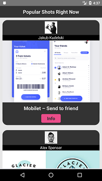
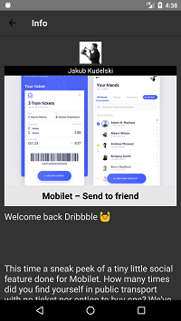

# Gallery App

    

* React-Native
* Using dribbble API
* Image fetched form dribble API
* Android Device Only
* How to run
  1. `git clone <url>`
  2. `cd GalleryApp`
  3. `npm install`
  4. `react-native run-android`
* aibrahim3546@gmail.com
* [yang@revenuemonster.my](yang@revenuemonster.my)
